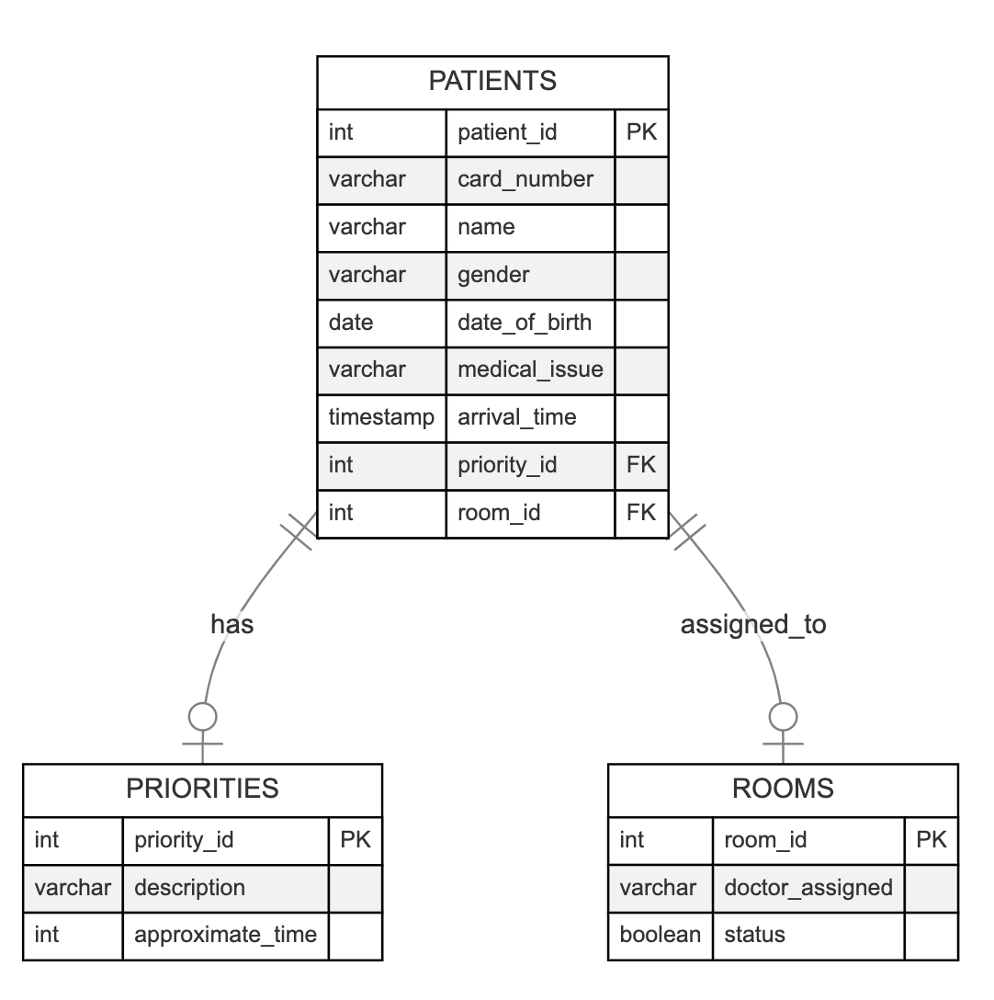

# Hospital Triage Database Design Documentation

## Entities Description

### Patients
This entity stores all relevant data about individuals seeking medical attention. It includes personal details and medical triage information, such as the patient's name, medical issue, and urgency level.

### Priorities
This entity categorizes the urgency of patients' conditions. It assists in managing the flow of the triage process and helps prioritize care based on severity, ensuring that critical cases receive immediate attention.

### Rooms
This entity contains details about the rooms available for patient care. It tracks the status of each room (whether it's occupied or available) and the medical personnel assigned to the room.

## Attributes Specification

### Patients Attributes:
- `patient_id` (integer): A unique identifier for each patient.
- `card_number` (varchar): The identification number on a patient's medical card.
- `first_name` (varchar): The first name of the patient.
- `last_name` (varchar): The last name of the patient.
- `gender` (varchar): The gender of the patient.
- `date_of_birth` (date): The birthdate of the patient.
- `medical_issue` (varchar): A description of the patient's medical issue or injury.
- `arrival_time` (timestamp): The date and time when the patient arrived at the hospital.
- `priority_id` (integer, FOREIGN KEY): A reference to the Priorities entity, indicating the urgency of the patient's condition.
- `room_id` (integer, FOREIGN KEY): A reference to the Rooms entity, indicating the patient's assigned room (if any).

### Priorities Attributes:
- `priority_id` (integer): A unique identifier for the priority level.
- `description` (varchar): A verbal explanation of the priority level (e.g., High, Medium, Low).
- `approximate_time` (integer): The estimated waiting time (in minutes) associated with each priority level, providing insight into how long patients may need to wait.

### Rooms Attributes:
- `room_id` (integer): A unique identifier for each room.
- `room_number` (varchar): The number or identifier of the room in the hospital.
- `doctor_assigned` (varchar): The name of the doctor assigned to the room, for identifying personnel assigned to each patient room.
- `status` (boolean): The occupancy status of the room; 'true' if the room is occupied, 'false' if available.

## Database ERD (Entity-Relationship Diagram)

The ERD illustrates the relationships between entities. The `Patients` entity is connected to the `Priorities` and `Rooms` entities through foreign keys, indicating the relationship between a patient's urgency level and their room assignment.
